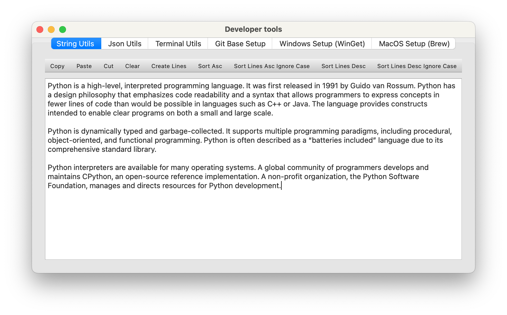
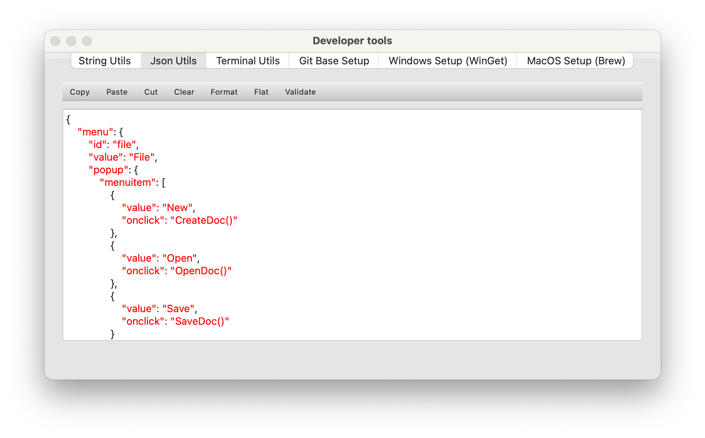
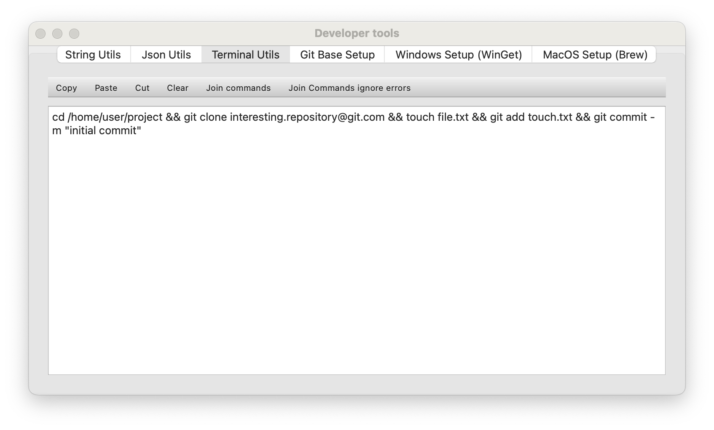
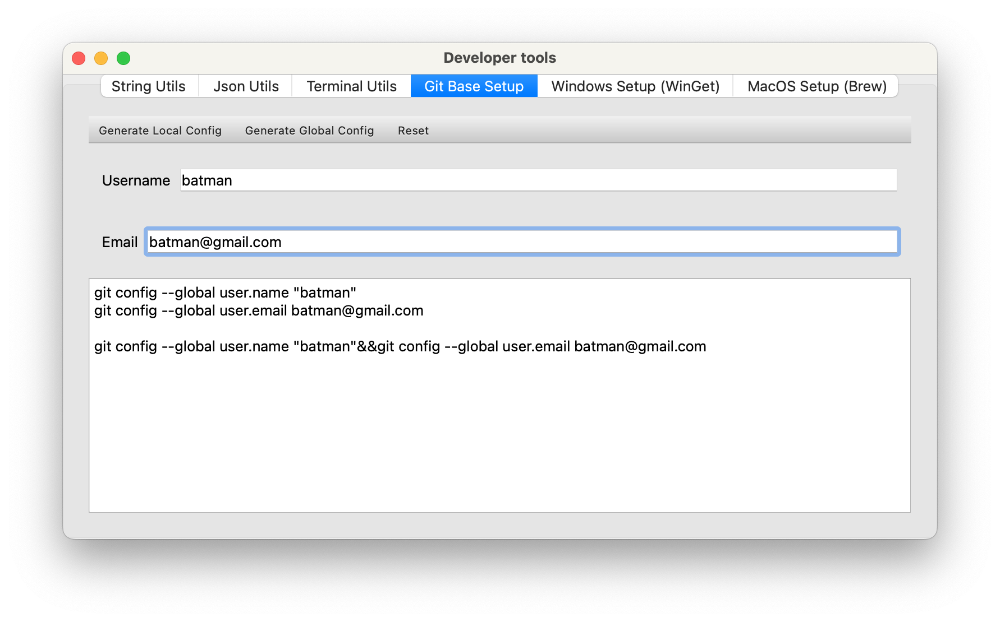
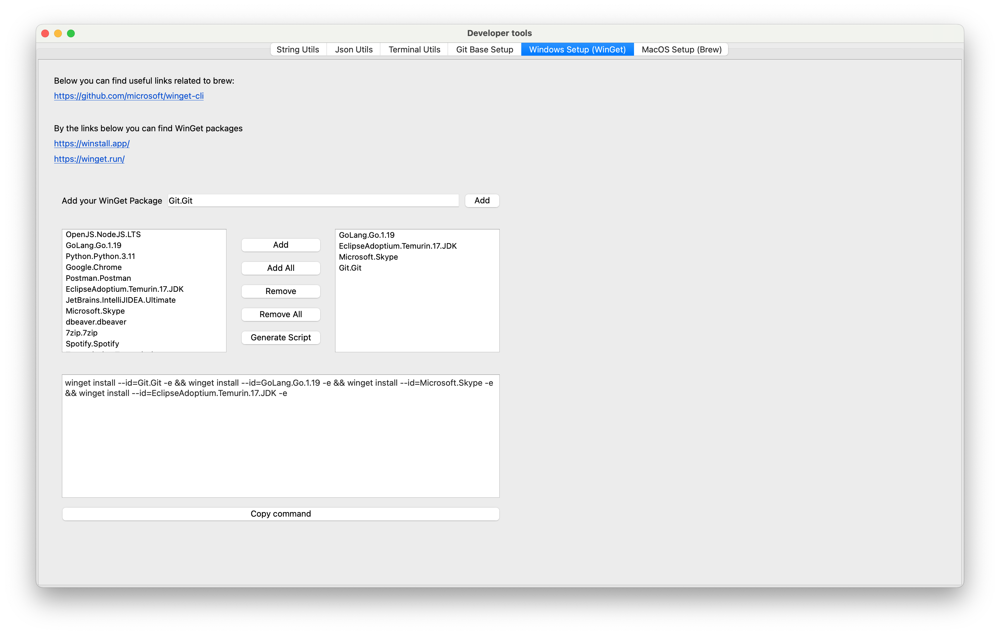
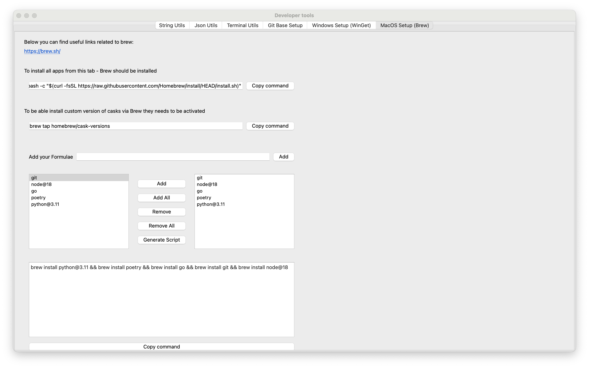

# dev_common_tools_py
- [dev\_common\_tools\_py](#dev_common_tools_py)
- [The main technologies that were used in the scope of this project](#the-main-technologies-that-were-used-in-the-scope-of-this-project)
- [How this app looks like](#how-this-app-looks-like)
- [Local build](#local-build)
  - [Prerequisites](#prerequisites)
  - [Build](#build)


Standard tools required in the everyday life of software engineer

This small application will provide common simple functions that can be used in everyday life by almost every developer without searching for them somewhere on the Internet.

First of all, it can generate terminal commands for example for Git username/email configuration, and brew/Winget commands to install everyday soft to the freshly installed OS.

Also, it provides string utils, for example, split/join text/lines, and sort ASC/DESC ignoring or not ignoring cases.

If you need to concatenate several terminal commands, this app can also do it.
# The main technologies that were used in the scope of this project

- Programming Language: Python 3.11.2 (All development was made on the Mac OS X)
- UI Framework: PySide6
- Dependency management: Pipenv
- Build tool (Binary distribution of the final APP): pyinstaller

# How this app looks like








# Local build

## Prerequisites

- You should have installed Python to you PC. Python installers and instructions can be found on the official [**Python
  Page**](https://www.python.org/)
- You also should have to install Pipenv package manager. Instruction can be found on the official [**Pipenv
  page**](https://pypi.org/project/pipenv/)
- If you want to clone this repository, then probably you also need a [**GIT**](https://git-scm.com/) preinstalled.

## Build
1. Open Terminal on your OS
2. Navigate to the folder with this app
```shell
cd /path/to/the/root/of/dev_common_tools_py
```
3. Install dependencies
```shell
pipenv install
```
4. (optional) Now you can run app manually
```shell
pipenv run python -m ui.dev_tools
```
5. To build EXECUTABLES to have app as one executable file for MacOS or Windows, or any supported OS try this command
```shell
pipenv run pyinstaller dev_tools.spec --clean
```

After this command execution in:
- folder build/dev_tools you will find build intermediate files
- folder dist you will find executable app for your OS where you run the build command (DevTools.exe/DevTools.app)

- Now you can use a built executable to run the app/game